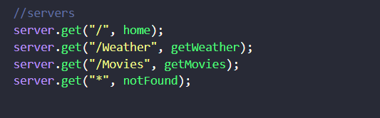
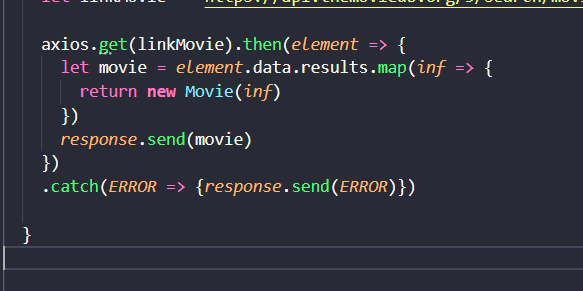
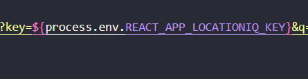
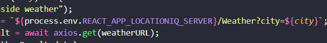
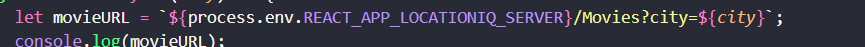
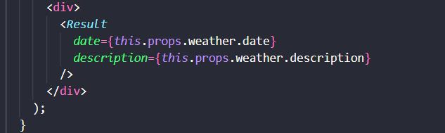

# Testing

i do some testing in my code

first of all here in server you can't add server not found before any server because the code run line by line and server not found must be last one.

function not found is a function if the web can't reach page will give you page not found.

 
//////////////////////////////////////////////

 I use .then and .catch. so when i use .then here i use it to check if i have error will go to catch and catch tell me i have error if i don't have error will print data.

 

////////////////////////////////////////////////
when we use API KEY we add these keys in folder called .nev and we add this folder in gitignore folder because these keys you just can use it and you don;t need any one use it and when use these keys you need to use process.nev.KYE_NAME like this

here if i don't use process.nev i will have error i can't bring location data in this key because i add key in folder nev

here also i will don't have weather and movie data if i don't use process.nev

///////////////////////////////
know i create parent file and chiled file , in chiled file can't access any property in parent file without props if i don't use props i will have error. just access with props.

